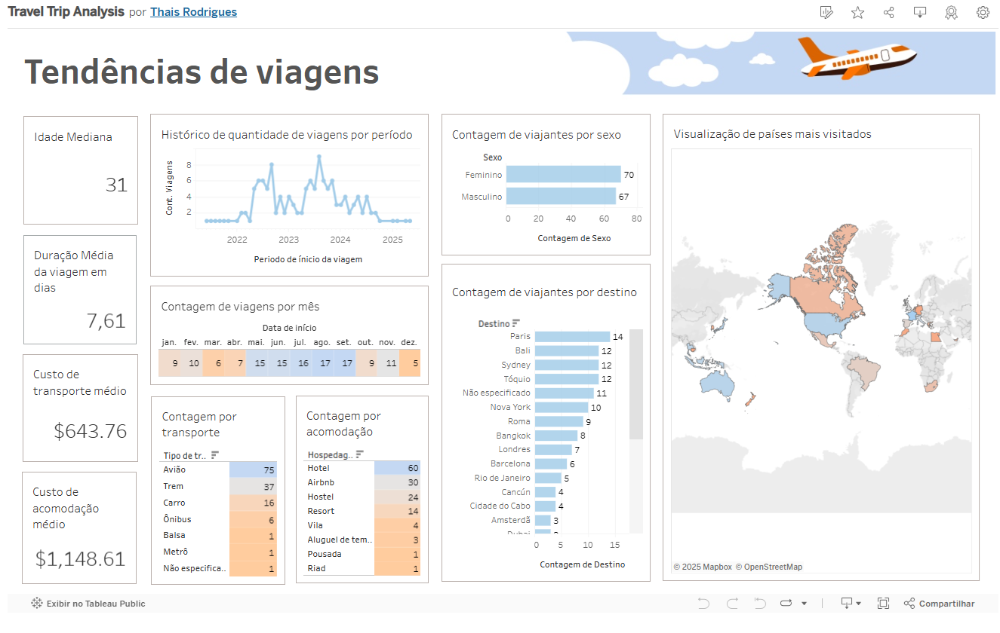

# Estratégias para impulsionar as vendas de viagens ao longo do Ano

**Tendências de Viagens** é um projeto desenvolvido para analisar dados de viagens e fornecer insights estratégicos que ajudam a impulsionar as vendas de pacotes e serviços turísticos ao longo do ano. O objetivo é identificar padrões para maximizar as vendas no setor.

Foram utilizados dados do Kaggle, especificamente do dataset [**rkiattisak/traveler-trip-data**](https://www.kaggle.com/datasets/rkiattisak/traveler-trip-data/data). Este conjunto de dados foi criado com fins educacionais, sendo estritamente proibido o uso comercial. Vale destacar que os dados foram gerados a partir de grandes modelos de linguagem e não foram coletados de fontes de dados reais.

## Pontos Chave

### 1. Monitore e Compreenda Suas Vendas
- Identifique padrões sazonais: Picos de vendas foram registrados no final de 2022 e 2023, mas esse comportamento não se repetiu em 2024.

Analise os concorrentes para entender se a queda nas vendas é devido a mudanças nas expectativas dos consumidores ou a fatores externos que afetam o setor.

### 2. Fique Atento às Novidades do Mercado
- Acompanhe o comportamento dos clientes: Desde 2022, aproximadamente 20% dos viajantes passaram a utilizar acomodações via Airbnb, tornando essa alternativa cada vez mais popular.

Busque diversificar as opções de hospedagem, incluindo acomodações em Airbnb nos pacotes de viagem, oferece mais conforto, espaço para famílias e opções econômicas, ampliando as possibilidades para os viajantes.

### 3. Entenda as preferências do seu cliente
- Personalize pacotes para destinos estratégicos: Ofereça opções próximas a Paris, Bali, Sydney e Tóquio, com preços mais acessíveis e facilidades de deslocamento.
- Conheça as opções de transporte: Embora a venda de passagens aéreas lidere o mercado, o trem se destaca como uma alternativa viável em determinadas regiões.

Elabore combinações inteligentes ao integrar passagens aéreas e viagens de trem em regiões com infraestrutura ferroviária eficiente. Considere preços em países vizinhos e a viabilidade de deslocamento, oferecendo roteiros mais acessíveis e econômicos para os viajantes.
  
### 4. Acima de tudo, conheça bem sua persona.
- Identifique o perfil do seu público: A distribuição de gênero é equilibrada, com predominância de jovens adultos em torno de 30 anos.
- Adapte a duração dos pacotes: A maioria dos clientes buscam viagens curtas, com média de 8 dias.
- Compreenda os períodos de alta demanda do seu público: As vendas atingem o pico entre maio e setembro, enquanto dezembro, março e abril apresentam uma demanda consideravelmente menor.

Ofereça pacotes com itinerários equilibrados entre exploração e descanso, e torne a baixa temporada atrativa com ofertas exclusivas e experiências locais únicas.

## Apresentação da solução: Tendências de viagens com Tableau

- Link de acesso ao projeto: [TravelTripAnalysis](https://public.tableau.com/app/profile/thais.nicole.rodrigues7737/viz/TravelTripAnalysis/Painel)

## Tecnologias Utilizadas
- **Python** (Pandas, Matplotlib, Numpy) para limpeza de dados.
- **Tableau** (Visualização de dados)

## Estrutura de pastas
- **dados/**  Armazena os dados brutos e processados.
- **notebooks/**  Contém análises exploratórias e técnicas.
- **visualizacoes/**  Guarda gráficos e dashboards gerados.
- **docs/**  Pasta dedicada à documentação do projeto.
